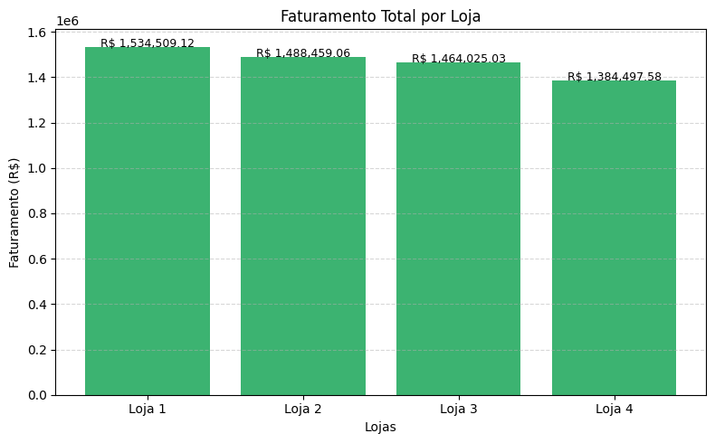
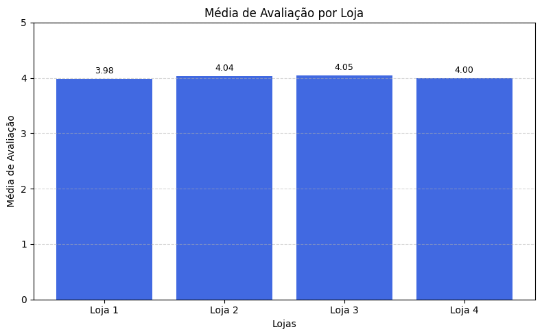
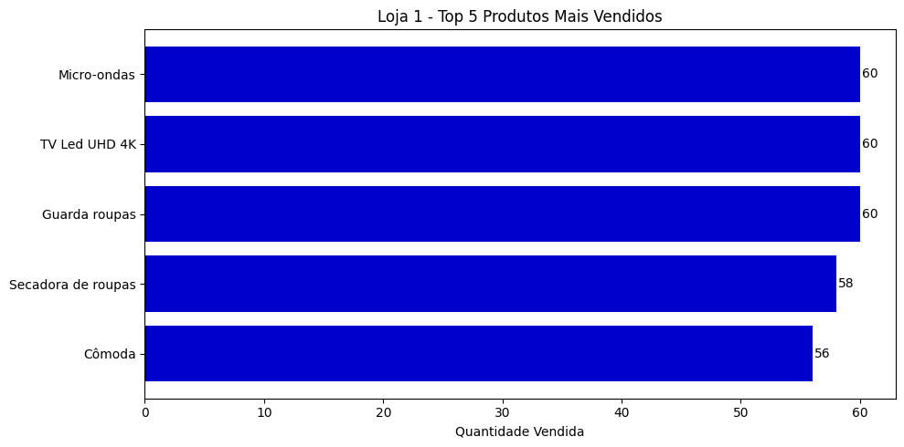
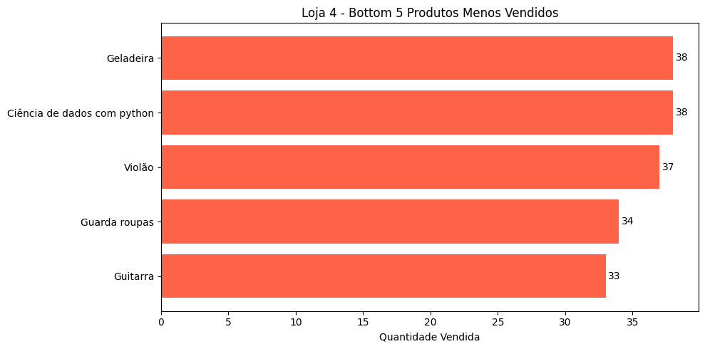
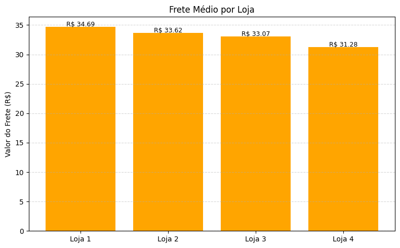

# 📊 ONE Data Science – Relatório Final

Este projeto tem como objetivo realizar uma análise detalhada das quatro lojas do Senhor João para identificar qual delas apresenta o menor potencial de crescimento ou desempenho mais fraco, recomendando-a para venda. A análise foi realizada com base em dados de faturamento, categorias de produtos, avaliações de clientes, produtos mais e menos vendidos e frete médio.

---

## 📝 Introdução

O Senhor João possui quatro lojas e deseja vender uma delas para focar seus esforços nas demais. Para isso, foram analisados os seguintes indicadores:

- **Faturamento total**.
- **Categorias de produtos mais e menos vendidas**.
- **Média das avaliações dos clientes**.
- **Produtos mais e menos vendidos**.
- **Frete médio**.

Com base nos dados fornecidos, foram gerados gráficos e insights que embasam a recomendação final.

---

## 🔍 Desenvolvimento da Análise

### 💰 Faturamento Total

O gráfico abaixo mostra o faturamento total de cada loja:



- **Loja 1** apresentou o maior faturamento, destacando-se como a mais rentável.
- **Loja 4** teve o menor faturamento, indicando um desempenho inferior em termos de receita.

---

### 📦 Categorias Mais e Menos Vendidas

O gráfico a seguir apresenta o faturamento por categoria de produto:


- **Loja 1 e Loja 2** concentram vendas em categorias de alto valor agregado, como "eletrônicos".
- **Loja 4** possui maior volume de vendas em categorias de baixo ticket médio, como "utilidades domésticas".

---

### ⭐ Média das Avaliações dos Clientes

O gráfico abaixo exibe a média das avaliações de clientes por loja:



- **Loja 1** obteve a melhor média de avaliações, refletindo maior satisfação dos clientes.
- **Loja 4** apresentou a pior média, indicando possíveis problemas com atendimento, produto ou entrega.

---

### 🔝 Produtos Mais e Menos Vendidos

Os gráficos a seguir mostram os produtos mais e menos vendidos por loja:

#### Loja 1 – Produtos Mais Vendidos


#### Loja 4 – Produtos Menos Vendidos


- **Loja 1** possui consistência em produtos best-sellers.
- **Loja 4** apresenta baixa recorrência de vendas, dificultando a escalabilidade.

---

### 🚚 Frete Médio

O gráfico abaixo compara o frete médio de cada loja:



- **Loja 3** tem o menor frete médio, indicando maior eficiência logística.
- **Loja 4** possui um dos fretes mais altos, impactando negativamente a competitividade.

---

## ✅ Conclusão e Recomendação

Com base nos dados analisados, **recomenda-se que a Loja 4 seja vendida**. Os principais motivos são:

- Menor **faturamento total**.
- **Baixa diversidade e desempenho de categorias** vendidas.
- **Pior média de avaliações** de clientes.
- **Produtos com baixa recorrência** de venda.
- **Frete médio elevado**, reduzindo a competitividade.

Por outro lado, **Loja 1** se destaca como a mais saudável do ponto de vista de negócios, enquanto as lojas 2 e 3 ainda apresentam oportunidades de crescimento.

A venda da Loja 4 permitirá ao Senhor João **focar seus esforços nas lojas mais rentáveis e com maior potencial**, otimizando os recursos da empresa.

---

## 📂 Estrutura do Projeto

- **base_dados/**: Contém os arquivos CSV com os dados das lojas.
- **colab/**: Contém o notebook Jupyter com as análises e gráficos gerados.

---

## 🚀 Como Reproduzir as Análises

1. Clone este repositório:
```bash
   git clone https://github.com/seu-usuario/ONE-Data_Science.git
   cd ONE-Data_Science
```
2. Instale as dependências:
```bash
   pip install pandas matplotlib
```
3. Abra o notebook no Jupyter:
```bash
   jupyter notebook colab/AluraStoreBr.ipynb
```
---

## Licença

Este projeto está licenciado sob os termos da [Licença MIT](https://opensource.org/licenses/MIT). Sinta-se à vontade para usar, modificar e distribuir este projeto, desde que os devidos créditos sejam mantidos.

---

## Agradecimentos

Este projeto foi desenvolvido como parte do programa **ONE (Oracle Next Education)**, uma iniciativa incrível que promove a educação e capacitação em tecnologia. Agradeço à equipe do ONE e à Alura pela oportunidade de aprendizado e crescimento profissional.

---